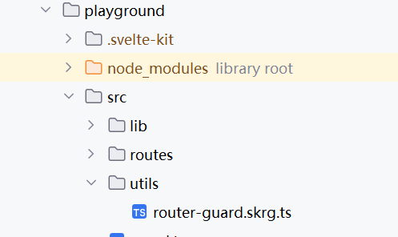

# vite-plugin-sk-router-guard
🪐 基于svelte-kit的全局客户端路由守卫插件

[English](./README.md) | 中文

## Core Strategy
`vite-plugin-sk-router-guard`会根据指定的钩子脚本路径，在 `root.svelte` 中引入，并注册上下文。  
然后在每一个 `+page.svelte` 中获取上下文并注册为[afternavigate](https://kit.svelte.dev/docs/modules#$app-navigation-afternavigate)或
[beforenavigate](https://kit.svelte.dev/docs/modules#$app-navigation-beforenavigate)。  
这样就是实现了类似“全局的路由守卫钩子函数”。

## Install

```bash
npm i vite-plugin-sk-router-guard -D
```
或
```bash
yarn add vite-plugin-sk-router-guard -D
```
或
```bash
pnpm add vite-plugin-sk-router-guard -D
```

## Usage
1. 使用插件并配置

```typescript
// vite.config.ts
import { sveltekit } from '@sveltejs/kit/vite'
import { defineConfig } from 'vite'
import skRouterGuard from 'vite-plugin-sk-router-guard'
export default defineConfig({
   plugins: [
      skRouterGuard(),
      sveltekit(),
   ],
})
```

2. 编写钩子脚本  
假设你的项目有如下路径:  
  
那么`vite-plugin-sk-router-guard`会默认加载这个路径下的脚本作为全局的路由导航方法  

```typescript
// router-guard.skrg.ts
export const navigate = {
  afterNavigate(
    navigation: import('@sveltejs/kit').AfterNavigate
  ){
    navigation.from && console.log('afterNavigate -> from\n',navigation.from.url.href)
    navigation.to && console.log('afterNavigate -> to\n',navigation.to.url.href)
  },
  beforeNavigate(
    navigation: import('@sveltejs/kit').BeforeNavigate
  ) {
    navigation.from && console.log('beforeNavigate -> from \n',navigation.from.url.href)
    navigation.to && console.log('beforeNavigate -> to \n',navigation.to.url.href)
  }
}

```

## Option

```typescript
export interface Options {
  /**
   * 钩子函数脚本路径
   * @default src/utils/router-guard.skrg.(ts/js)
   */
  hookPath?: string

}
```

## Tips
* `vite-plugin-sk-router-guard`只会对 `+page.svelte` 和 `root.svelte` 进行代码注入
* `router-guard.skrg` 必须导出一个名为 `navigate` 的对象
